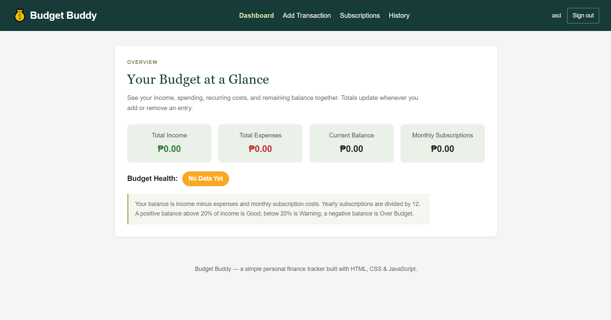
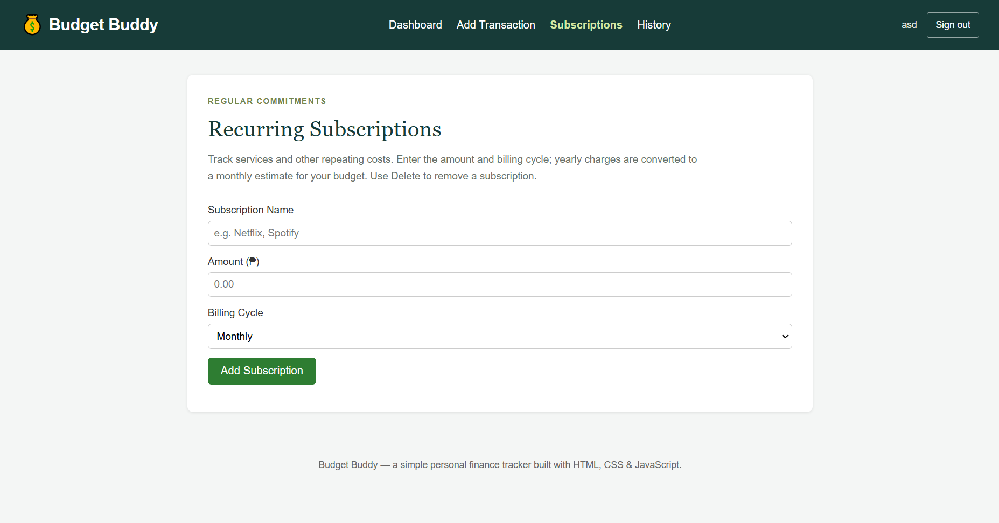
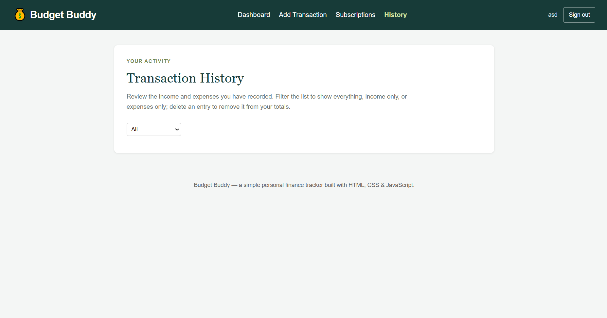

[README.md](https://github.com/user-attachments/files/32670832/README.md)
# Budget Buddy

A simple browser-based personal finance and subscription tracker. Users can log income and expenses, manage recurring subscriptions, filter their transaction history, and see a real-time budget health indicator.

**Current phase:** Static front-end prototype (HTML, CSS, JavaScript). App data and the demo sign-in session are saved in the browser using `localStorage` — no backend/server needed.

---

## Screenshots

### Sign Up


### Sign In


### Dashboard


### Add Transaction


### Subscription


### History


---

## Tech Stack

- HTML
- CSS
- JavaScript (vanilla, no frameworks)
- Browser localStorage (for saving data)

---

## Project Structure

```
budget-buddy/
├── index.html          # Authentication and hash-routed app views
├── img/                # Screenshots shown in this README
│
├── css/
│   └── style.css       # Authentication, navigation, and app styling
│
├── js/
│   └── main.js         # Authentication prototype, routing, and tracker logic
```

The app uses one HTML document with separate hash-routed views for Dashboard, Add Transaction, Subscriptions, and History. The page links its CSS and JavaScript like this:
```html
<link rel="stylesheet" href="css/style.css">
<script src="js/main.js"></script>
```

---

## How to Run It

No installs needed. Pick one:

**Option A — Just open it**
Double-click `index.html` and it opens in your browser.

**Option B — VS Code Live Server (recommended)**
Install the "Live Server" extension → right-click `index.html` → "Open with Live Server."

**Option C — Terminal**
```bash
npx http-server .
```
Then open the local URL it prints.

---

## Features

| Feature | Where |
|---|---|
| Add income/expense | "Add a Transaction" form |
| Add recurring subscription (Monthly/Yearly) | "Recurring Subscriptions" form |
| Filter transactions (All / Income / Expenses) | Dropdown above transaction history |
| Delete a transaction or subscription | Delete button on each list item |
| Live totals (income, expenses, balance, subscriptions) | Dashboard cards |
| Budget health indicator (Good / Warning / Over Budget) | Badge below the dashboard cards |
| Prototype sign-in and sign-up (any non-empty text is accepted) | Authentication screen |
| Navigate between app views | Navigation bar |

---

## How the Budget Health Indicator Works

1. Adds up all income and all expenses.
2. Adds up subscriptions, turning yearly ones into a monthly amount (`yearly amount ÷ 12`).
3. Balance = Income − Expenses − Monthly Subscriptions.
4. Badge color:
   - 🟩 **Good** — balance is more than 20% of income
   - 🟨 **Warning** — balance is positive but less than 20% of income
   - 🟥 **Over Budget** — balance is negative

---

## Notes

- All data is stored only in the current browser (`localStorage`). Clearing browser data will erase transactions and subscriptions.
- Authentication is for prototype demonstration only. There is no backend, credential validation, or secure account system; do not enter real passwords.
- This is Milestone 1 of the project — charts and real payment integration are not included yet. See the Implementation Plan for planned future improvements.
